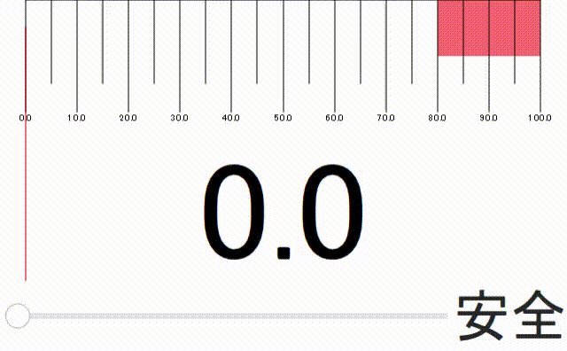

# メータープラグイン使用例

---



本コードはレッドゾーン付きのメーターを作成して

入力値がレッドゾーンを超えたら危険であることを表示するサンプルコードである。

自作プラグイン内のMeterエレメントを使用することでこれら機能を実現している。

メータープラグインの詳細は[/plugins/meter/README.md](./plugins/meter/README.md)へ記載した。

# ビルド方法

---

```term
mkdir ./build
cd ./build
cmake ..
make run
```

