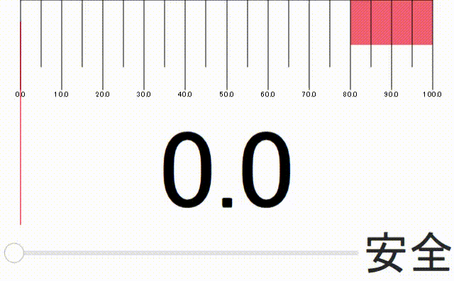

# Qt-Quick-Examples
Qt Quickにまつわるサンプルコード

| プロジェクト名 |            備考            |                  gifアニメ                   |
| :------------: | :------------------------: | :------------------------------------------: |
|  analog clock  |        アナログ時計        |  |
|     meter      | レッドゾーン付きのメーター |         |

