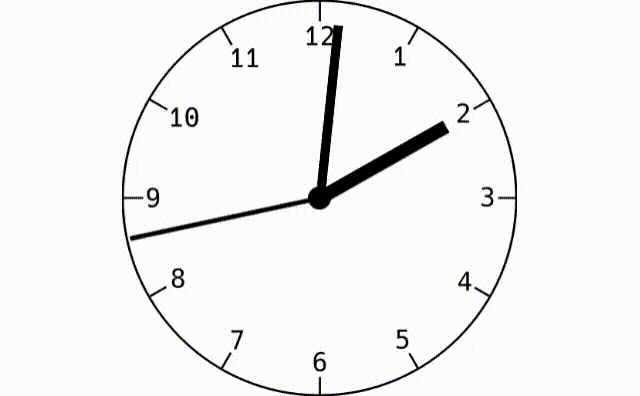

# analog clock

---

当プロジェクトはアナログ時計を表示するGUIアプリケーションのサンプルである。

| プロジェクト名 |     備考     |                   gifアニメ                   |
| :------------: | :----------: | :-------------------------------------------: |
|  analog clock  | アナログ時計 |  |


# フォルダ構造

---

```cmd
analog clock
    │  CMakeLists.txt
    │  README.md
    │
    ├─plugins
    │  │  CMakeLists.txt
    │  │
    │  └─analog_clock #ここからアナログ時計プラグイン
    │      │  CMakeLists.txt
    │      │  qmldir
    │      │
    │      ├─img #画像データ用フォルダ
    │      │      base.svg
    │      │      centor.svg
    │      │      hour.svg
    │      │      img.qrc
    │      │      minute.svg
    │      │      second.svg
    │      │
    │      ├─include
    │      │      clock_backend.hpp #Clock.qml用のバックエンドのヘッダ
    │      │      plugin.hpp #QQmlExtensionPluginのサブクラスのヘッダ
    │      │
    │      ├─qml
    │      │      Clock.qml #アナログ時計本体
    │      │      qml.qrc
    │      │
    │      └─src
    │              clock_backend.cpp #Clock.qml用のバックエンドの実装
    │              plugin.cpp #QQmlExtensionPluginのサブクラスの実装
    │
    ├─qml
    │      main.qml #基底ウィンドウ
    │      qml.qrc 
    │
    └─src
            main.cpp #エントリーポイント
```

# ビルドと実行

---

```cmd or terminal
mkdir build
cd ./build
cmake ..
make run
```

#  登場するクラスやqmlエレメント

---

- clock_component::ClockBackend クラス (clock_backend.hppとclock_backend.cpp)
  - int get_hour() const メソッド
    - 時間を整数で出力
  - int get_minute() const メソッド
    - 分を整数で出力
  - int get_second() const メソッド
    - 秒を整数で出力

- Clockエレメント(Clock.qml)
  - アナログ時計を表示するエレメントであり、内部にTimerエレメントを保持し、100msに一回上記バックエンドc++クラスより現在時刻を取得し、画面に反映する。