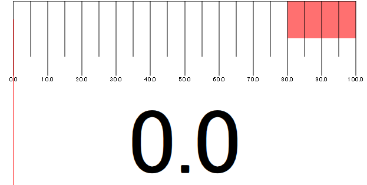

# QML用 meter プラグイン

---

本プラグインはQMLでメーターを扱うためのMeterエレメントを提供するプラグインである。



# Meterエレメント

---

プロパティ一覧

| 型     | 名前                | 初期値                     | 備考                       |
| ------ | ------------------- | -------------------------- | -------------------------- |
| real   | max_value           | 100                        | メーターで計測できる最大値 |
| real   | value               | 0                          | 針が示す値                 |
| int    | decimal_place       | 1                          | 表示する小数点の桁数       |
| bool   | scale_visible       | true                       | 目盛り表示フラグ           |
| int    | scale_num           | 10                         | 大目盛りの数               |
| real   | danger_zone         | 80                         | レッドゾーンの最小値       |
| color  | danger_zone_color   | Qt.rgba(1., 0.2, 0.2, 0.7) | レッドゾーンの色           |
| bool   | danger_zone_visible | true                       | レッドゾーン表示フラグ     |
| color  | scale_color         | "black"                    | 目盛りの色                 |
| bool   | nidle_visible       | true                       | 針の表示フラグ             |
| color  | nidle_color         | "red"                      | 針の色                     |
| bool   | value_text_visible  | true                       | 数値表示部分の表示フラグ   |
| color  | text_color          | "black"                    | 数値表示部分の色           |
| string | unit                | ""                         | 数値表示部分の単位         |


シグナル一覧

| 名前              | 備考                                                        |
| ----------------- | ----------------------------------------------------------- |
| aboveDangerZone() | valueプロパティがレッドゾーンに入った場合送出されるシグナル |
| belowDangerZone() | valueプロパティがレッドゾーンから出た場合送出されるシグナル |


## インストール方法

---

```term
cd ./meter/plugins/meter
mkdir ./build
cd ./build
cmake -DCMAKE_INSTALL_PREFIX="path/to/plugin/directory" -DCMAKE_BUILD_TYPE=Release
ninja -j8
ninja install
```

[注意]

上記"path/to/plugin/directory"の内容は

プラグインのインストール先であり一般的には

"QTのインストール先/QTのバージョン番号/ビルドキット名/qml"となる

>  (例) cmake .. -DCMAKE_INSTALL_PREFIX="C:\Qt\5.15.2\mingw81_64\qml"

